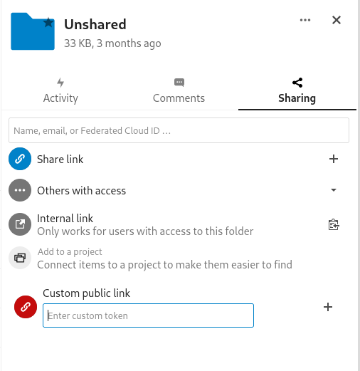
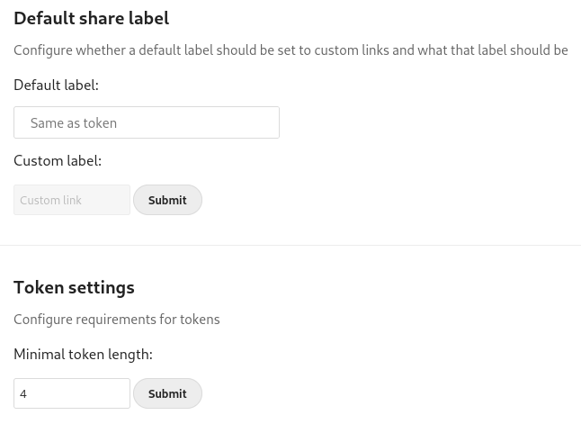

# Configurable Share Links

Nextcloud app that adds the ability to specify share tokens when creating new public links and change tokens of existing links.

This app was built using [tutorial notes app](https://github.com/nextcloud/app-tutorial) as a skeleton.

# Usage

- Download the [gzip archive from the latest release](https://github.com/jimmyl0l3c/cfg-share-links/releases/latest/download/cfgsharelinks.tar.gz)
- Extract the folder **cfgsharelinks** into your NC **apps** folder
- Enable **Configurable Share Links** in apps (in Nextcloud)

# Build frontend from source

- Run `make dev-setup` to install frontend dependencies
- Run `make build-js` or `make build-js-production` to build

# Preview

Sharing sidebar is expanded by new section (Custom public link) that allows you to create public links with custom share tokens as can be seen in the first screenshot.

You can also customize share tokens of existing public links as can be seen in the second screenshot.

Admins can set default labels for custom links and minimal token length as can be seen in the next screenshot.
Default label can be: none, same as token or custom (the same custom label for all custom links).

